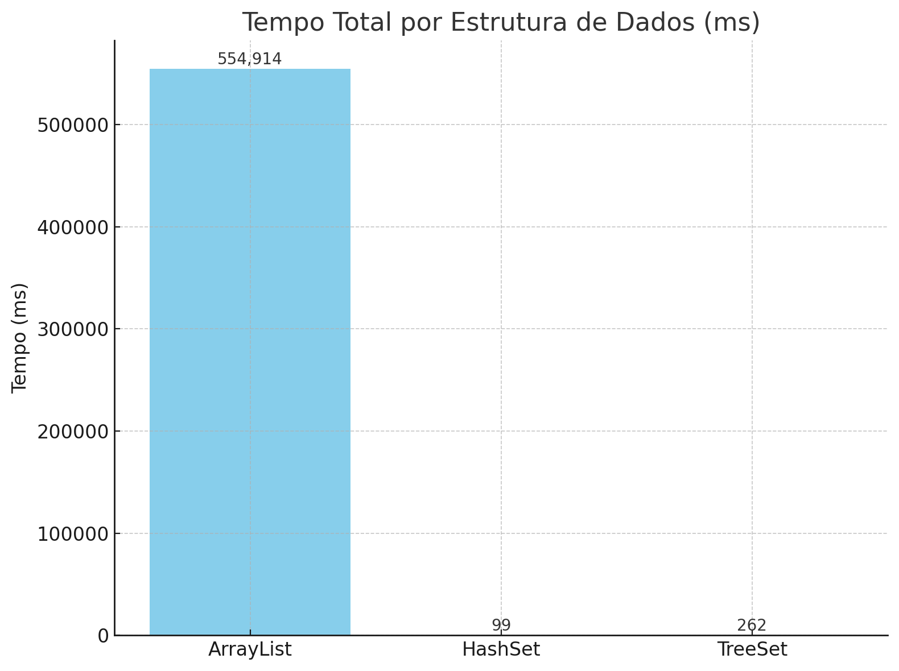
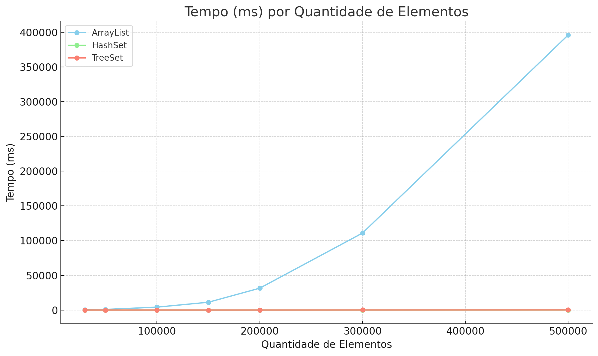

# CollectionPerformance

## Comparativo simples de ArrayList, HashSet e TreeSet

### ArrayList<>()

Uma implementação de lista baseada em um array redimensionável, que mantém a ordem de inserção dos elementos e permite elementos duplicados. É eficiente para acesso aleatório rápido, mas pode ser mais lento para operações de adição e remoção quando a lista é grande, devido à necessidade de redimensionamento e deslocamento dos elementos.
ArrayList quando precisar de uma coleção ordenada com acesso rápido

### HashSet<>()

Uma implementação de conjunto baseada em uma tabela hash, que não mantém nenhuma ordem específica e não permite elementos duplicados. É geralmente mais rápido para operações de adição, remoção e verificação de existência de elementos, devido à sua implementação baseada em tabela hash. 
Quando precisar de uma coleção sem duplicadas e com operações rápidas de adição e remoção.

### TreeSet<>()
Uma implementação de conjunto baseada em uma árvore binária balanceada (Red-Black Tree), que mantém os elementos automaticamente ordenados e não permite elementos duplicados. Oferece operações de adição, remoção e busca com complexidade O(log n), sendo mais lento que HashSet mas mais rápido que ArrayList para buscas. É ideal quando você precisa de elementos únicos e sempre ordenados.
Use TreeSet quando precisar de uma coleção sem duplicatas, com elementos sempre ordenados e operações moderadamente rápidas.

### Melhor Performance
Para o código mencionado, a melhor performance se deu para o HashSet.
ArrayList possui a menor performance segundo o código utilizado.
TreeSet apresenta performance intermediária, sendo consistentemente melhor que ArrayList mas inferior ao HashSet.

### Quando usar cada um?

- HashSet: Melhor performance geral, use quando não precisar de ordem
- TreeSet: Use quando precisar de elementos ordenados automaticamente
- ArrayList: Use quando precisar manter ordem de inserção e permitir duplicatas

## Output de uma das execuções

| Estrutura  | Tempo (ms) | Elementos |
|------------|------------|-----------|
| ArrayList  | 247        | 30000     |
| HashSet    | 7          | 30000     |
| TreeSet    | 22         | 30000     |
| ArrayList  | 883        | 50000     |
| HashSet    | 5          | 50000     |
| TreeSet    | 14         | 50000     |
| ArrayList  | 4161       | 100000    |
| HashSet    | 8          | 100000    |
| TreeSet    | 26         | 100000    |
| ArrayList  | 11207      | 150000    |
| HashSet    | 3          | 150000    |
| TreeSet    | 26         | 150000    |
| ArrayList  | 31458      | 200000    |
| HashSet    | 15         | 200000    |
| TreeSet    | 25         | 200000    |
| ArrayList  | 110900     | 300000    |
| HashSet    | 19         | 300000    |
| TreeSet    | 53         | 300000    |
| ArrayList  | 396058     | 500000    |
| HashSet    | 42         | 500000    |
| TreeSet    | 96         | 500000    |

